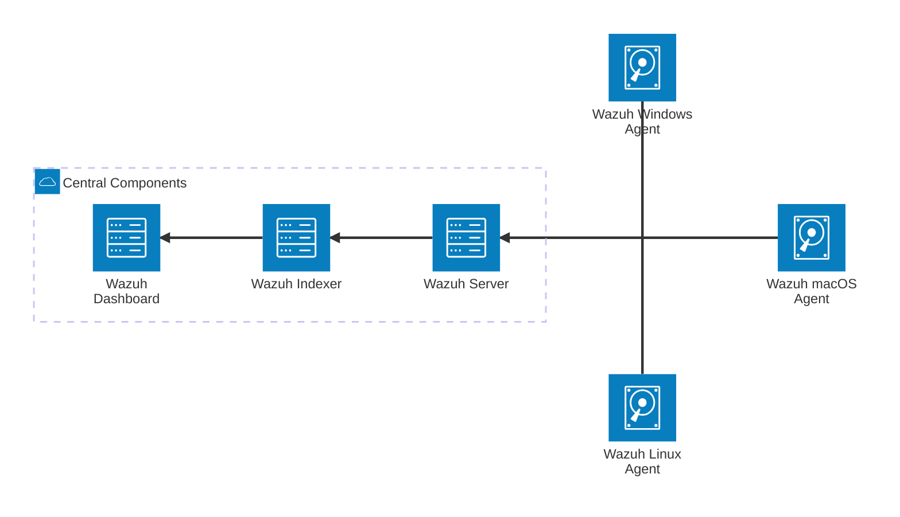

## Wazuh

> Wazuh는 XDR과 SIEM 기능을 통합한 무료 오픈소스 보안 플랫폼이다. On-premises, 가상화 환경, 컨테이너 환경, 그리고 클라우드 서비스와의 연계까지 모든 환경에서 시스템 보호가 가능한 것이 특징이다. Wazuh는 모든 환경 속에 있는 데이터를 사이버 위협으로부터 보호하는 목적을 가지고 있다.

## Wazuh Components

Wazuh는 로그 데이터 분석과 바이러스와 침입 탐지, 파일 위변조 탐지, 취약점 탐지, 그리고 시스템들의 환경 설정을 확인하고 규칙을 따르도록 함으로써 모든 환경의 시스템을 보호한다. 이를 위해 각각의 환경에 설치되는 **에이전트(Wazuh agent)**가 있다. 에이전트는 노트북이나 컴퓨터, 서버, 클라우드 인스턴스나 가상환경에 설치되며, 위협을 탐지하고 예방한다.

에이전트를 관리하는 서버도 있다. 서버는 세 가지가 있는데, **메인 서버(Wazuh server)**와 **인덱서(Wazuh indexer)**, 그리고 **대시보드(Wazuh dashboard)**가 있다.

메인 서버는 에이전트로부터 받은 모든 데이터를 분석한다. 서버에는 에이전트 데이터를 파싱하는 **디코더(decoders)**와 경고를 생성하는 **규칙(rules)**들이 있다. 이를 통해 침해지표(Indicator of Compromise, IoC) 분석을 할 수 있다. 서버는 또한 에이전트를 관리할 때 사용되기도 한다. 서버를 통해 에이전트의 설정을 바꾸거나 업그레이드 시킬 수 있다.

인덱서는 메인 서버가 생성한 보안 경고를 검색 가능한 형태로 저장하고 분석해 통계를 낸다. 데이터가 엄청나게 늘어나도 클러스터링으로 확장해 감당 가능하도록 확장성을 고려하여 설계되었다.

대시보드는 웹 형태로 제공되는 사용자 인터페이스이다. 대시보드를 통해 인덱서에 저장된 데이터를 시각화하고 검색할 수 있다. 또한 대시보드를 통해 메인 서버의 에이전트 관리 기능을 사용할 수도 있다. 어떤 에이전트가 동작중인지 확인할 수 있고, 어떤 파일을 감시할 것인지, 몇시간을 주기로 확인할 것인지 등 에이전트의 설정을 원격으로 바꿀 수도 있다.

## Wazuh Architecture

Wazuh는 여러 플랫폼에 설치 가능한 에이전트와 중앙화된 세 개의 서버로 운영된다. 에이전트는 기기에 설치되어 보안 데이터를 수집하고 메인 서버에 전송한다. 메인 서버는 에이전트로부터 받은 데이터를 분석하고 인덱서에게 보낸다. 인덱서는 분석된 데이터를 받아 저장하고 인덱싱한다. 그 위에서 대시보드는 보안 경고를 사용자에게 보내고 데이터를 시각화한다.

이 때 세 개의 서버는 하나의 서버에서 배포될 수도 있고, 각각의 서버에서 배포될 수도 있다. 또한 여러개의 메인 서버, 여러개의 인덱서, 여러개의 대시보드 형태도 가질 수 있다.

### 에이전트와 메인 서버의 통신

에이전트는 끊임없이 메인 서버에게 이벤트를 보낸다. 메인 서버는 이벤트를 분석하고 위협을 탐지한다. 기본적으로 에이전트는 서버에게 보내는 메시지를 AES 알고리즘을 통해 암호화한다. 암호화된 메시지는 서버의 1514/TCP 로 보내진다. 서버는 1514/TCP로 받은 메시지를 분석 엔진을 통해 디코딩하고 규칙에 맞게 보안 경고를 만든다.

### 메인 서버와 인덱서의 통신

메인 서버는 Filebeat를 통해 인덱서에게 보안 경고와 이벤트 데이터를 TLS 암호화 하여 보낸다. Filebeat는 9200/TCP에서 메인 서버로부터 데이터를 받아 인덱서에게 전달한다. 데이터가 인덱서에 인덱싱되면 대시보드가 인덱싱 된 데이터를 통해 질의하고 시각화한다.

### 대시보드와 인덱서의 통신

대시보드 55000/TCP에서 TLS로 암호화된 API를 제공한다. 대시보드에 접근하기 위해서는 미리 설정된 아이디와 비밀번호가 필요하다. 대시보드에서는 메인 서버와 에이전트의 상태와 구성 정보를 확인할 수 있다. 또한 인덱서에 인덱싱되어 있는 데이터를 질의하고 시각화할 수 있다.

## 정리

Wazuh는 여러 플랫폼에서 에이전트로 보안과 관련된 모든 데이터를 모아 메인 서버에서 분석해 인덱서에서 인덱싱하고 대시보드를 통해 인덱싱된 데이터를 시각화한다. 이를 통해 네트워크의 각 노드에 쌓이는 로그들을 분석하고 시각화하여 사이버 위협을 찾아낼 수 있다.
