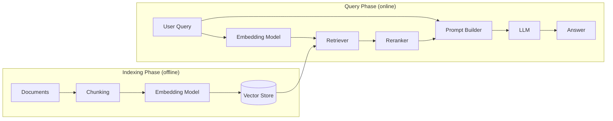

LLM은 강력하지만 근본적인 한계가 있다. **자신이 모르는 것을 모른다고 말하지 않는다.** 학습 데이터 바깥의 질문을 받으면 "잘 모르겠습니다" 라고 답하는 대신 그럴듯한 답을 자신감 있게 만들어낸다. 이 현상이 바로 **hallucination** 이고, LLM을 프로덕션에 투입하는 데 가장 큰 장벽이었다.

Retrieval-Augmented Generation(RAG)은 이 문제에 대한 가장 실용적인 해법 중 하나다. 학습 시점에 모델이 정보를 외우기를 기대하는 대신, 질의 시점에 관련 컨텍스트를 검색해 모델의 입력에 함께 주입한다. 모델은 자신의 파라메트릭 기억(parametric memory)에만 의존하지 않고, 검색된 컨텍스트에 **근거(grounded)** 한 답을 생성한다.

## RAG가 해결하려는 문제

LLM 단독 사용에는 네 가지 구조적 한계가 있다.

- **Hallucination**: 학습 분포 밖의 질문에 대해 그럴듯한 거짓을 생성한다
- **Knowledge cutoff**: 학습 시점 이후의 정보는 알지 못한다
- **Domain knowledge gap**: 사내 문서, 비공개 데이터베이스, 특정 도메인의 지식은 학습되지 않았다
- **Source attribution 부재**: 답을 어디서 가져왔는지 출처를 제시할 수 없다

RAG는 이 네 가지를 **모델 외부의 검색 가능한 지식 저장소**로 해결한다. 모델은 답을 외울 필요가 없고, 답의 재료를 입력으로 받아 조립한다.

> [!note]
> **Parametric memory vs Non-parametric memory**
> 모델 가중치 안에 압축되어 있는 지식이 parametric memory, 외부 저장소에 평문 또는 임베딩 벡터로 저장되어 검색 가능한 지식이 non-parametric memory다. RAG는 본질적으로 LLM에 non-parametric memory를 부착하는 패턴이다.

## RAG Pipeline

RAG는 크게 두 단계로 나뉜다.

- **Indexing Phase**: 문서를 청크로 분할하고 임베딩해 벡터 저장소에 넣는 사전 처리 단계
- **Query Phase**: 사용자 질의를 임베딩해 관련 청크를 검색하고, LLM에 컨텍스트로 주입해 답을 생성하는 실시간 단계

## Indexing Phase

### Document Loading
- PDF, HTML, Markdown, Notion, Confluence, S3, 사내 위키 등 이질적인 소스에서 문서를 수집함
- 로딩 단계에서 메타데이터를 함께 보존해야 함
  - 출처(URL, 파일 경로), 작성일, 작성자, 권한 정보 등
  - 검색 시 필터링과 출처 표기에 사용됨

### Chunking
- 문서를 임베딩이 가능한 작은 단위로 잘라내는 단계
- 청크의 크기와 경계가 RAG 품질의 절반을 결정함
- 너무 작으면 의미가 단편화되고, 너무 크면 임베딩이 흐려져 검색 정확도가 떨어짐
- 주요 전략은 네 가지

|전략|설명|장점|약점|
|---|---|---|---|
|**Fixed-size**|문자 수 또는 토큰 수로 고정 분할|단순하고 빠름|문장/단락을 끊는 경우가 많음|
|**Recursive**|구조적 구분자(`\n\n`, `\n`, ` `)를 단계적으로 적용|문서 구조를 어느 정도 보존|구분자가 없는 형식에 약함|
|**Semantic**|문장 임베딩의 유사도 변화 지점에서 분할|의미 경계 보존|연산 비용이 높음|
|**Document-aware**|HTML, Markdown 등의 마크업 구조를 활용|섹션 단위로 자연스러운 분할|문서 형식별 파서가 필요|

- 청크 간 **overlap** 을 두는 것이 일반적
  - 청크 경계에 걸친 정보가 끊기는 문제를 줄이기 위함
  - 보통 청크 크기의 10-20% 정도

### Embedding
- 텍스트를 의미를 보존하는 고차원 벡터로 변환하는 단계
- 모델 선택이 검색 품질을 직접 결정함
  - **Dense embedding**: OpenAI `text-embedding-3`, Cohere `embed-v3`, BGE, E5 등
  - **Sparse embedding**: BM25, SPLADE 등 키워드 기반 표현
  - **Multi-vector embedding**: ColBERT 등 토큰 단위 벡터를 보존하는 방식
- 임베딩 모델은 도메인에 따라 fine-tuning 하거나 도메인 특화 모델로 교체할 필요가 있음
- 임베딩 차원이 클수록 표현력은 높지만 저장/검색 비용이 증가함

### Vector Store
- 임베딩 벡터와 원문 청크, 메타데이터를 함께 저장하는 데이터베이스
- 핵심 연산은 **Approximate Nearest Neighbor (ANN) 검색**
  - 정확한 거리 계산은 $O(n)$ 이라 대규모 데이터에 사용 불가
  - HNSW, IVF, ScaNN 등의 인덱스로 sub-linear 시간에 근사 검색
- 주요 선택지
  - **Self-hosted**: pgvector, Qdrant, Weaviate, Milvus
  - **Managed**: Pinecone, Vertex AI Vector Search, AWS OpenSearch
- 거리 함수는 보통 cosine similarity 또는 dot product가 사용됨

## Query Phase

### Query Embedding
- 사용자 질의를 indexing 단계와 **동일한 임베딩 모델**로 벡터화
- 모델이 다르면 같은 의미 공간에 매핑되지 않아 검색이 작동하지 않음
- 질의가 짧고 모호한 경우가 많아, 후술할 query rewriting과 결합하는 경우가 많음

### Retrieval
- 질의 벡터와 유사한 top-k 청크를 벡터 저장소에서 검색
- 단순 dense retrieval만으로는 키워드 일치가 약하기 때문에 **hybrid search** 가 표준이 되어가는 중
  - **Dense retrieval**: 의미적 유사도에 강함, 동의어와 의역에 강건
  - **Sparse retrieval (BM25)**: 정확한 용어 일치, 고유명사와 코드에 강함
  - **Hybrid**: 두 결과를 RRF(Reciprocal Rank Fusion) 등으로 결합
- 메타데이터 필터링을 함께 적용해 검색 공간을 좁힘
  - 예: 사용자의 권한 범위 안의 문서만, 특정 날짜 이후 문서만

### Reranking
- Top-k 검색 결과를 더 정밀한 모델로 재정렬하는 단계
- Retrieval은 **recall** 을 위해 넓게 가져오고, reranking은 **precision** 을 위해 좁힘
- 일반적으로 **cross-encoder** 가 사용됨
  - 질의와 문서를 함께 입력으로 받아 관련도 점수를 직접 출력
  - bi-encoder(임베딩 비교) 보다 정확하지만 느려서 top-k 결과에만 적용
- Cohere Rerank, BGE Reranker, ColBERT 등이 주로 사용됨

### Prompt Construction
- 검색·재정렬된 청크를 LLM 프롬프트로 조립하는 단계
- 일반적인 구조는 다음과 같음
  - **System instruction**: "주어진 컨텍스트만을 근거로 답하라, 모르는 경우 모른다고 답하라"
  - **Retrieved context**: 청크들을 출처와 함께 나열
  - **User query**: 원본 질의
- 청크의 순서, 형식, 출처 표기 방식이 답변 품질에 영향을 미침
  - LLM이 컨텍스트의 처음과 끝을 더 잘 보는 **lost-in-the-middle** 현상이 있어, 가장 관련성 높은 청크를 양 끝에 배치하기도 함

### Generation
- LLM이 컨텍스트와 질의를 입력으로 받아 답변을 생성
- 출처(citation)를 함께 출력하도록 프롬프트를 설계하는 것이 일반적
- 사후 검증으로 모델의 답변이 실제 컨텍스트에 근거하는지 확인하는 **groundedness check** 를 추가하기도 함

## 고도화 패턴

기본 RAG가 깨지는 지점을 보완하기 위한 패턴들이 빠르게 발전하고 있다.

### Query Rewriting
- 사용자의 짧고 모호한 질의를 검색에 유리한 형태로 다시 쓰는 단계
- 대화형 RAG에서는 이전 대화 맥락을 반영해 독립적인 질의로 재구성하는 것이 필수적
- 예: "그 문제는 어떻게 해결해?" → "방금 언급된 OAuth 토큰 만료 문제를 해결하는 방법"

### HyDE (Hypothetical Document Embeddings)
- 짧은 질의를 임베딩하는 대신, LLM이 만든 **가상의 답변** 을 임베딩해 검색에 사용함
- 질의-문서 간 어휘 격차를 줄여 검색 품질을 높임

### Multi-query / Fusion
- 하나의 질의를 여러 변형으로 생성해 각각 검색한 뒤 결과를 결합
- 단일 질의 임베딩이 놓치는 측면을 보완

### Contextual Retrieval
- 청킹 시 각 청크에 LLM이 생성한 **문맥 요약**을 prepend해 임베딩 품질을 높이는 방식
- 청크가 원래 문서에서 어떤 위치, 어떤 주제의 일부인지를 명시적으로 표현

### Agentic RAG
- 단일 검색-생성 파이프라인이 아닌, **에이전트가 질의를 분해하고 반복적으로 검색** 하는 구조
- 복잡한 다단계 질의에 강함
- [[agentic-ai-stack]] 의 Orchestration Layer와 결합되며, 검색이 하나의 tool로 노출되는 형태

### GraphRAG
- 문서를 평면 청크 집합이 아닌 **엔티티-관계 그래프** 로 색인
- 다중 홉(multi-hop) 추론과 전체 코퍼스의 요약 질의에 강함
- 인덱싱 비용이 매우 높다는 단점이 있음

## RAG가 깨지는 지점

RAG는 만능이 아니다. 실제 운영에서는 파이프라인 곳곳에서 정확도가 무너진다.

- **임베딩이 의미를 보존하지 못하는 경우**
  - 도메인 특화 용어, 약어, 코드 식별자 등은 일반 임베딩 모델이 잘 표현하지 못함
  - 도메인 fine-tuning 또는 hybrid search로 보완
- **청크 경계가 정보를 자르는 경우**
  - 답에 필요한 정보가 두 청크에 걸쳐 있으면 둘 중 하나만 검색되고 다른 하나는 누락됨
  - overlap, contextual retrieval, parent-document retrieval로 완화
- **Top-k가 부족하거나 과도한 경우**
  - 너무 적으면 정답 청크가 누락(recall 저하), 너무 많으면 노이즈 청크가 답을 흐리거나 컨텍스트 윈도우를 낭비
  - reranker로 큰 k에서 줄이는 패턴이 일반적
- **검색된 컨텍스트가 서로 모순되는 경우**
  - 동일한 사실에 대해 여러 버전의 문서가 존재하면 LLM이 어느 쪽을 따를지 결정해야 함
  - 메타데이터 기반 freshness 가중치, 출처 신뢰도 점수 등으로 처리
- **Generator가 컨텍스트를 무시하는 경우**
  - LLM이 검색된 컨텍스트보다 자신의 parametric memory를 신뢰해 잘못된 답을 내는 현상
  - 명시적인 system instruction과 groundedness 평가로 감지
- **Lost-in-the-middle**
  - 긴 컨텍스트의 중간에 위치한 정보를 LLM이 놓치는 현상
  - 청크 순서 조정, top-k 축소, 또는 reranker로 길이를 통제
- **권한·보안 누수**
  - 사용자가 접근 권한이 없는 문서가 검색에 포함되는 경우
  - 메타데이터 필터링은 retrieval 단계에서 적용해야 하며, 단순히 프롬프트로 지시해서는 안 됨

## RAG 평가

RAG는 모델만 평가해서는 안 되고 **검색 품질** 과 **생성 품질** 을 분리해서 봐야 한다.

- **Retrieval metrics**: 정답 청크가 잘 검색되었는가
  - **Recall@k**: top-k 안에 정답 청크가 포함된 비율
  - **MRR (Mean Reciprocal Rank)**: 정답 청크의 순위 역수 평균
  - **nDCG**: 순위 가중 누적 이득
- **Generation metrics**: 답변이 검색된 컨텍스트에 충실한가
  - **Faithfulness / Groundedness**: 답변이 컨텍스트에 근거하는가
  - **Answer relevancy**: 답변이 실제 질문에 답하는가
  - **Context precision**: 검색된 컨텍스트 중 실제로 사용된 비율
- 도구로는 **RAGAS**, **TruLens**, **LangSmith** 등이 자동화된 평가를 제공함
- LLM-as-a-judge 패턴이 사실상 표준이지만, judge 자체가 편향과 한계를 가지므로 golden dataset과 함께 운영해야 함

## RAG vs Fine-tuning vs Long Context

같은 문제를 해결하는 다른 접근들과의 비교.

|구분|RAG|Fine-tuning|Long Context|
|---|---|---|---|
|**지식 갱신**|문서만 갱신하면 즉시 반영|재학습 필요|매 호출마다 컨텍스트 주입|
|**비용 모델**|벡터 저장소 + 검색 비용|학습 비용 한 번 + 추론 비용|매 호출 토큰 비용 선형 증가|
|**출처 추적**|가능|불가능|가능하지만 비용이 큼|
|**도메인 스타일/말투**|약함|강함|중간|
|**대규모 코퍼스**|적합|부적합|컨텍스트 윈도우 한계|

- 셋은 **상호 배타적이지 않다**
  - 도메인 어휘는 fine-tuning으로, 사실 지식은 RAG로, 짧은 세션 맥락은 long context로 분담
- "long context가 충분히 길면 RAG가 필요 없다" 는 주장이 주기적으로 등장하지만, 비용·지연·lost-in-the-middle·실시간 갱신 측면에서 RAG는 여전히 유효함

> [!note]
> RAG는 단일 기술이 아니라 **검색 시스템 + 프롬프트 엔지니어링 + LLM** 을 조합하는 아키텍처 패턴이다. 따라서 RAG의 품질은 LLM의 성능보다 **검색 시스템의 품질** 에 더 크게 좌우된다. RAG가 잘 동작하지 않을 때, 가장 먼저 의심해야 하는 것은 모델이 아니라 임베딩과 청킹이다.
